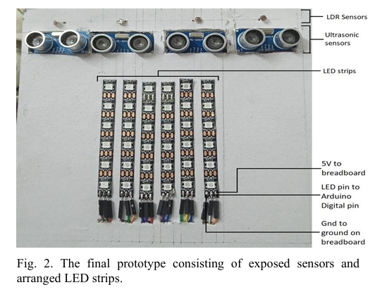
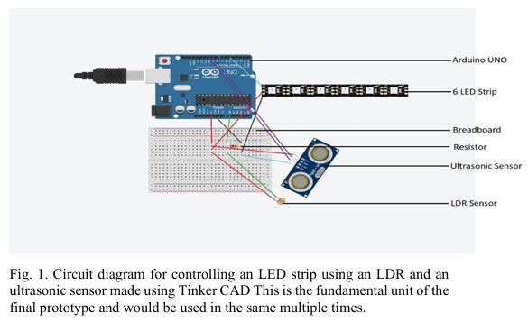
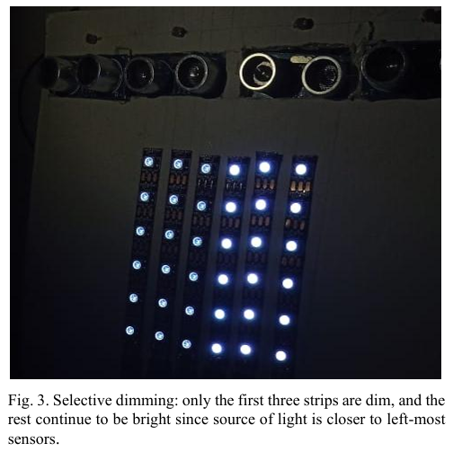

# LightSync: An Adaptive Headlight System for Cars

**[Project Report (PDF)](https://iitgnacin-my.sharepoint.com/:b:/g/personal/23110297_iitgn_ac_in/Ef-WhrOE6JlNr_L5CjBn-CYBnfBUMu1mJLxHcsxrRzR-dQ?e=qcZoaQ)**  
**[Video Demonstration](https://iitgnacin-my.sharepoint.com/:v:/g/personal/23110297_iitgn_ac_in/EReBIv6KEcVCipME7AQs5ZoB4F0uxc-wcTuNr7tLYog7Gw?nav=eyJyZWZlcnJhbEluZm8iOnsicmVmZXJyYWxBcHAiOiJPbmVEcml2ZUZvckJ1c2luZXNzIiwicmVmZXJyYWxBcHBQbGF0Zm9ybSI6IldlYiIsInJlZmVycmFsTW9kZSI6InZpZXciLCJyZWZlcnJhbFZpZXciOiJNeUZpbGVzTGlua0NvcHkifX0&e=RJJ7ZP)**

<!-- ## Team Members
- Shardul Rakesh Junagade (Mechanical Engineering, IIT Gandhinagar, 23110297@iitgn.ac.in)
- Shah Tirth (Electrical Engineering, IIT Gandhinagar, 23110295@iitgn.ac.in)
- Shail Bhargavkumar Joshi (Electrical Engineering, IIT Gandhinagar, 23110296@iitgn.ac.in) -->

## Abstract
LightSync is an adaptive headlight system designed to automatically adjust the brightness of car headlights based on the distance and light intensity of oncoming vehicles. By using a combination of LDRs (Light Dependent Resistors), ultrasonic sensors, and Arduino Uno boards, the system aims to reduce glare and improve road safety during night-time driving.

## Motivation
High-beam headlights are a major cause of temporary blindness and night-time accidents. Manual adjustment of headlight intensity is often neglected or inaccurate. LightSync automates this process, selectively dimming or switching off LED strips facing the direction of incoming vehicles, inspired by advanced automotive lighting systems but implemented with accessible components.

## Prototype

  
   <em>Fig. 1: Prototype of the LightSync system</em>

## Hardware Used
- 2 × Arduino UNO boards
- 4 × Light Dependent Resistors (LDR)
- 4 × HC-SR04 Ultrasonic Sensors
- 6 × WS2812B LED strips (6 LEDs each)
- 1 × Breadboard
- 4 × 10 kΩ resistors
- Connecting wires

## System Overview & Architecture
LightSync integrates both hardware and software to deliver adaptive headlight control:

- **Sensing:** Each fundamental unit consists of an LDR (for light intensity) and an ultrasonic sensor (for distance), both interfaced with an Arduino Uno. These sensors are strategically positioned to monitor multiple directions around the vehicle.
- **Control Logic:** The Arduino continuously reads sensor values. When the measured distance is below a set threshold and incoming light intensity is high, the system dims or switches off the corresponding LED strip. This logic is implemented in `lightsync.ino` using the Adafruit NeoPixel library for smooth LED transitions.
- **LED Arrangement:** Six WS2812B LED strips are arranged to simulate car headlights, with parallel connections for some strips. The strips are distributed across two Arduino boards for modularity and scalability.
- **Assembly:** All components are mounted on a breadboard and a demonstration board, with careful wiring for power, ground, and signal lines. The use of 10 kΩ resistors with LDRs ensures accurate voltage division for light sensing.

  
   <em>Fig. 2: Fundamental circuit with 1 LED, ultrasonic sensor, and LDR</em>

 
This architecture allows LightSync to selectively and smoothly adjust headlight brightness in real time, minimizing glare for oncoming drivers while maintaining optimal road visibility.

## Code
The Arduino code ([`lightsync.ino`](lightsync.ino)) implements the logic for reading sensor values and controlling the LEDs. It uses the Adafruit NeoPixel library for smooth fading effects. Thresholds for distance and light intensity are calibrated for optimal performance.

## Results
- The system dims or switches off LEDs facing the direction of an approaching light source, reducing glare for oncoming drivers.
- Handles multiple sources from different directions by selectively dimming relevant LED strips.
- 10 kΩ resistors were found optimal for LDR voltage division.

  
   <em>Fig. 3: Example showing selective dimming of LED strips</em>

## References
1. [Times of India: 74% vehicles using blinding headlights](https://timesofindia.indiatimes.com/city/chandigarh/74-vehicles-using-blinding-headlights-on-highways/articleshow/55424160.cms)
2. [Why use a 10K resistor with an LDR? (Arduino Stack Exchange)](https://arduino.stackexchange.com/questions/16525/why-should-i-put-a-10k-resistor-with-an-ldr#:~:text=LDR%20have%20a%20changing%20resistance)
3. [Arduino-based optical proximity sensor using IR LEDs](https://www.engineersgarage.com/arduino-ir-led-ir-photodiode-proximity-sensor/)
4. [Distance measurement using Ultrasonic sensor and Arduino (GeeksforGeeks)](https://www.geeksforgeeks.org/distance-measurement-using-ultrasonic-sensor-and-arduino/)
5. [Adafruit NeoPixel - Arduino Reference](https://www.arduino.cc/reference/en/libraries/adafruit-neopixel/)

## Acknowledgements
We thank Prof. Arup Lal Chakraborty, lab TA Mohit Tewari, and the Electrical lab staff at IIT Gandhinagar for their support and guidance.

## License
This project is licensed under the MIT License. See the [LICENSE](LICENSE) file for details.
